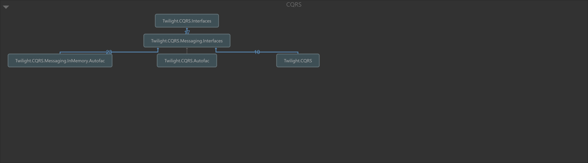

# Twilight

See the [LICENSE](LICENSE) file for legal guidance on using the code in this repository. The MIT license was dropped as that could expose the author to potential software patent abuse by external consumers of this code.

## Introduction

Twilight is an implementation of the CQRS design pattern that, 'out-of-the-box', provides an in-memory message transport that uses [Autofac](https://autofac.org/) to register its components. It is meant to be used as a learning resource for the basis of a full-featured system.

It is not intended for this repository to be published as NuGet packages, as support is not possible. The expectation is to use this repository as an educational resource and fork for your own specific requirements. It will be periodically updated to the latest version of .Net.

### Requirements

- Microsoft Visual Studio 2026+
- .NET 10.0

## CQRS

CQRS stands for Command Query Responsibility Segregation, i.e. keep actions that change data separate from actions that query data sources.

In its essence, CQRS enables the separation of a read model from a write model. You can use different data sources for your read and write models - or not. It also makes it extremely easy to keep separate concerns just that - separate.

CQRS is often confused with Event Sourcing (ES), as CQRS can form a solid foundation to support ES (e.g. querying in ES is difficult without CQRS or some similar mechanism). However, ES is not required for CQRS.

This repository currently provides an example of CQRS but remember - you don't always need to use CQRS. When implementing a solution, don't over-engineer and always ask yourself if the implemented architecture can be simplified.

The sample in this repository is trivial in order to clearly demonstrate usage.

Further information on the use-case for CQRS: [https://microservices.io/patterns/data/cqrs.html](https://microservices.io/patterns/data/cqrs.html)

## Event Sourcing (ES)

As we have touched on the topic above, a short expansion on what ES provides is warranted.

ES persists the state of a business entity as a sequence of state-changing events. There is no static 'CRUD' data model.

The current state of a domain entity is 'rebuilt' by replaying recorded events until the current state is reached. A bank account is a good example. There is no recorded account balance, rather the balance is calculated by replaying the deposit, transfer and withdrawal messages for that account until a current account balance is reached.

ES is a non-trivial pattern that requires a deep understanding of many advanced topics and patterns to implement and therefore is not suitable for all business use-cases. It can lead to an overly complicated architecture and an excessive maintenance overhead.

Further information on the use-case for ES: [https://microservices.io/patterns/data/event-sourcing.html](https://microservices.io/patterns/data/event-sourcing.html)

## CQRS Components

CQRS revolves around the production and consumption of messages, of which there are three types: commands, queries and events.

### Messages

A message conveys intent and purpose within a software system. Messages have a unique identifier (the message id) and a correlation identifier that identifies a series of actions in a workflow. In addition, there is a causation identifier. The causation identifier specifies which previous message (if any) caused the current message to be produced. The correlation id, together with the causation id enables the tracing of the entire journey a message may take through distributed systems.

Messages form the basis of CQRS commands, queries and events. A command, query or event is a message: something you send to, or make abvailable to, a recipient.

#### Commands

Commands are messages that effect change in a system (like updating a record in a database). A command can have zero or more parameters.

Strictly, commands should be fire-and-forget. This can be a difficult concept to take on board as the retrieval of the result of a command (e.g. the identifier for a created entity) is decoupled from the process that creates it.

#### Queries

Queries request information from a system and receive a response payload containing the requested data (if found). A query may or may not have a request payload that is used to shape the data in the response payload.

#### Events

Events are often published in order to tell other parts of a system that a change has occurred, for example to update a data view for reporting analysis. An event may or may not contain a payload with information useful to a party listening for the event.

### Handlers

A handler is required to act as a middleman between messages and the intended destination(s) for their payloads. A handler will consume a message, decide what to do with it (e.g. call a downstream service) and may return a response (that can be used to indicate success or contain a payload). Any error encountered while handling a message (such as the message failing validation) causes an exception to be thrown.

There can only be one handler for a specific command or query. Unlike commands and queries, events can be consumed by multiple handlers (a powerful capability of CQRS).

## Use of Result Pattern
The Results pattern is a design pattern used to encapsulate the outcome of an operation, whether it succeeds or fails, along with additional contextual information. It promotes cleaner and more predictable code by separating the handling of successful and failed outcomes.

Twilight uses [FluentResults](https://github.com/altmann/FluentResults), a popular NuGet package that implements the Results pattern in C#. It provides a rich set of classes and methods for working with results and is widely used in C# applications for robust error handling and outcome management.

This pattern fosters cleaner, more maintainable code by separating the logic for handling success and failure outcomes, improving code readability, and facilitating better error reporting and debugging.

## Architecture

Twilight CQRS is broken into discrete areas of functionality in order to best separate concerns. It allows the implementer to use as much or as little of the code as possible without introducing unwanted dependencies.

The following dependency graph shows the careful planning of the relationships between the components of Twilight CQRS.



## API Documentation

The XML documentation for the public API can be used to generate full developer documentation for Twilight.

You can use DocFX to generate the documentation. For more information, see [here](https://dotnet.github.io/docfx/). If you run into issues, try pointing your docfx.json to your build assemblies, instead of the project files or source code.

## The Sample

The sample exists to show the mechanics of creating, sending and handling commands, queries and events.

As an implementer, much of the structure of messages and handlers is up to you. Strive for as much simplicity as possible. All too often, applications are routinely over-engineered.

The samples are stripped down to make them easy to follow and makes use of Open Telemetry to illustrate the path of a message through the system. Using activity identifiers, correlation and causation, you can easily build a full path and timeline of all system interactions.

## Should I Use This?
If you're not I/O constrained, and only need basic pipeline functionality, then yes, this library is a good fit. It provides a simple way to implement CQRS without the overhead of more complex libraries. And it's fast. Very fast.

```
BenchmarkDotNet v0.15.6, Linux Ubuntu 24.04.3 LTS (Noble Numbat)
Intel Core Ultra 7 265K 3.88GHz, 1 CPU, 16 logical and 16 physical cores
.NET SDK 10.0.100-rc.2.25502.107
  [Host]     : .NET 10.0.0 (10.0.0-rc.2.25502.107, 10.0.25.50307), X64 RyuJIT x86-64-v3
  DefaultJob : .NET 10.0.0 (10.0.0-rc.2.25502.107, 10.0.25.50307), X64 RyuJIT x86-64-v3
```
| Method              | Count | Mean     | Error   | StdDev  | Gen0     | Allocated |
|-------------------- |------ |---------:|--------:|--------:|---------:|----------:|
| Send 1000 Commands  | 1000  | 695.8 μs | 5.42 μs | 4.81 μs | 154.2969 |   2.31 MB |
| Send 1000 Queries   | 1000  | 560.2 μs | 3.51 μs | 3.28 μs |  80.0781 |    1.2 MB |
| Publish 1000 Events | 1000  | 666.3 μs | 4.52 μs | 4.23 μs | 150.3906 |   2.25 MB |

Observed throughput:

- Send Command: 0.000696ms (0.696µs)
- Send Query: 0.000560ms (0.560µs)
- Publish Event: 0.000666ms (0.666µs)

## Naming Twilight

This project started out some time ago with a grander aim and was going to use the Paramore Brighter and Darker repositories. When that was dropped as being unnecessarily ambitious, the name as a combination of Brighter and Darker, Twilight, stuck with attendant *"can you see what I did there?"* gusto.

The Brighter and Darker projects are excellent examples of how complicated the topic of CQRS can get!

Paramore, incidentally, is also the name of an American rock group and *"Brighter"* is the fourth track from their first album, *"All We Know is Falling"*. Paramore also have a track called, *"Decode"* and that was the second song played in the end credits of the 2008 romantic fantasy film, *"Twilight"*. There you go.

## Sources

We all learn from the teachings and example of others and this project is no exception. The following sources provided pointers and inspiration for this repository:

- [https://github.com/jbogard/MediatR](https://github.com/jbogard/MediatR)
- [https://martinfowler.com/bliki/CQRS.html](https://martinfowler.com/bliki/CQRS.html)
- [https://martinfowler.com/eaaDev/EventSourcing.html](https://martinfowler.com/eaaDev/EventSourcing.html)

## Note

Twilight incorporates [Open Telemetry](https://opentelemetry.io/). A console exporter has been added to the sample so you can view the telemetry.